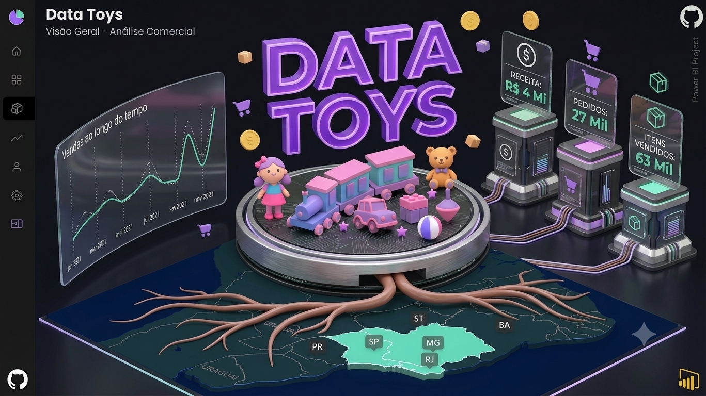
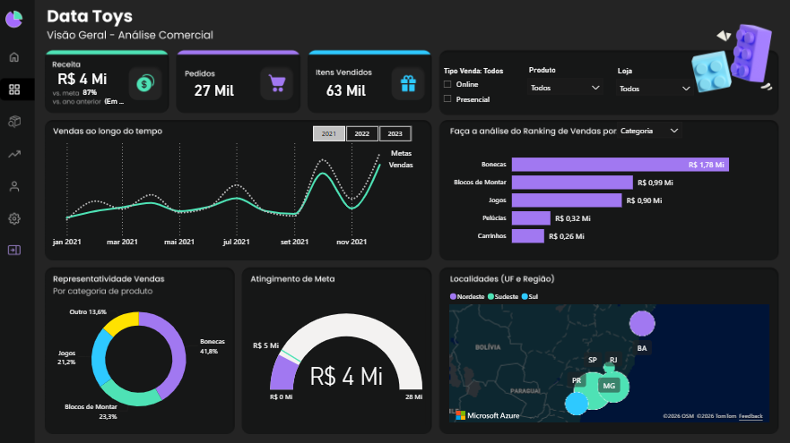
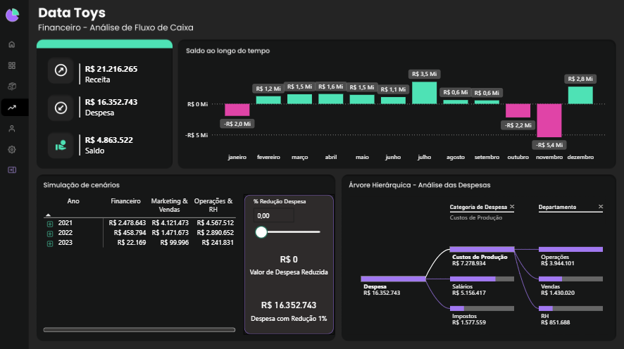

  

# DataToys | Dashboard Comercial e Financeiro

Projeto de análise comercial, estoque e desempenho financeiro da empresa fictícia DataToys utilizando Power BI, DAX, Power Query e Figma.

## 🚀 Dashboard Interativo

Explore a versão interativa do dashboard publicada no Power BI Service:

🔗 [Visualizar Dashboard](https://app.powerbi.com/view?r=eyJrIjoiNjE4NTQ3NDctYjlhMC00YzBlLWJkY2EtNmQ1YmU1MjhmM2U4IiwidCI6ImQ3NzNiNzQxLWE4ODYtNDQxNi1hYmUwLTVjNzIzYTc5MmIzMiJ9)

## 🎯 Objetivo do Projeto

Desenvolver um dashboard corporativo para análise comercial, controle de estoque e acompanhamento financeiro da empresa fictícia DataToys, permitindo o monitoramento de indicadores estratégicos e apoiando a tomada de decisão por meio da visualização de dados.

O projeto foi estruturado para fornecer uma visão integrada das operações da empresa, abrangendo desempenho de vendas, gestão de produtos, movimentação de estoque e resultados financeiros.

## ⚙️ Tecnologias Aplicadas

- Power BI
- DAX
- Power Query
- Modelagem de Dados
- Figma

## 📊 Principais Indicadores

### Comercial
- Faturamento
- Quantidade Vendida
- Evolução das Vendas
- Atingimento de Metas
- Distribuição Geográfica

### Financeiro
- Receita
- Despesa
- Saldo
- Evolução do Saldo
- Despesas por Categoria e Departamento
- Simulação de Cenários
- Redução de Custos por Área

## 📈 Análise Comercial

A página Comercial foi desenvolvida para acompanhar o desempenho das vendas da empresa, permitindo analisar indicadores como faturamento, quantidade vendida, vendas ao longo do tempo, atingimento de metas e distribuição geográfica das vendas.

Essa visão fornece uma compreensão clara dos resultados comerciais, auxiliando na identificação de oportunidades e no acompanhamento da performance do negócio.

  

## 💰 Análise Financeira

A página Financeira foi desenvolvida para monitorar o desempenho econômico da empresa por meio de indicadores de receita, despesa e saldo, permitindo acompanhar a evolução dos resultados ao longo do tempo e identificar períodos de superávit e déficit.

Além do acompanhamento financeiro, a página oferece uma visão detalhada das despesas por categoria e departamento através de uma árvore hierárquica interativa, bem como uma análise de cenários que simula reduções de custos em áreas estratégicas como Financeiro, Marketing e Vendas, Operações e Recursos Humanos, apoiando a tomada de decisão e o planejamento financeiro.

  

## 🎓 Contexto de Desenvolvimento

O projeto DataToys foi desenvolvido como parte da minha jornada de aprendizado em Análise de Dados e Business Intelligence, com o objetivo de aplicar conceitos de modelagem de dados, transformação de informações e criação de dashboards corporativos.

Durante o desenvolvimento, foram utilizados recursos do Power Query para tratamento dos dados, modelagem relacional para estruturação das informações e medidas DAX para construção dos indicadores de desempenho. O layout e a experiência visual foram planejados no Figma, buscando uma navegação intuitiva e alinhada às boas práticas de visualização de dados.

Este projeto representa uma etapa importante da minha evolução na construção de soluções analíticas voltadas para apoio à tomada de decisão.

## 🛠️ Principais Competências Desenvolvidas

- Modelagem de dados para análise comercial e financeira
- Criação de medidas e indicadores utilizando DAX
- Tratamento e transformação de dados com Power Query
- Desenvolvimento de dashboards interativos no Power BI
- Análise de desempenho comercial e acompanhamento de metas
- Controle financeiro e monitoramento de resultados
- Simulação de cenários para apoio à tomada de decisão
- Design e prototipação de interfaces no Figma
- Storytelling com dados e visualização de informações

## 📌 Conclusão

O DataToys foi um projeto fundamental para consolidar conhecimentos em Power BI, modelagem de dados, DAX e Power Query, permitindo a aplicação prática de conceitos de análise comercial e financeira em um cenário corporativo.

Além do desenvolvimento técnico, o projeto contribuiu para aprimorar habilidades de visualização de dados, construção de indicadores estratégicos e criação de dashboards voltados ao apoio da tomada de decisão.
